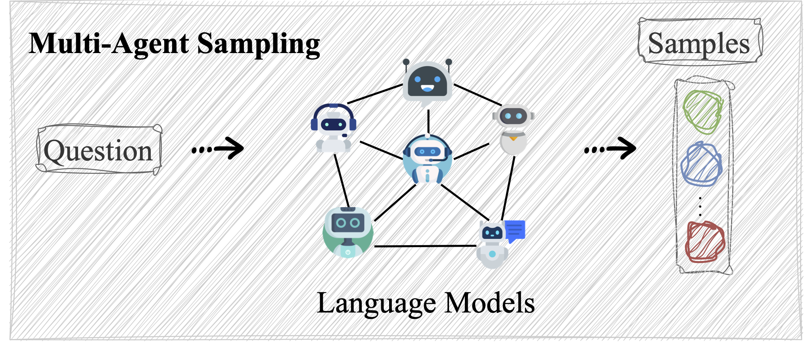
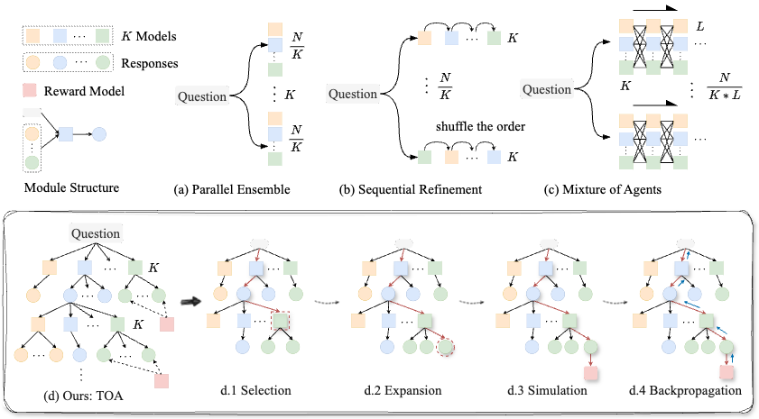
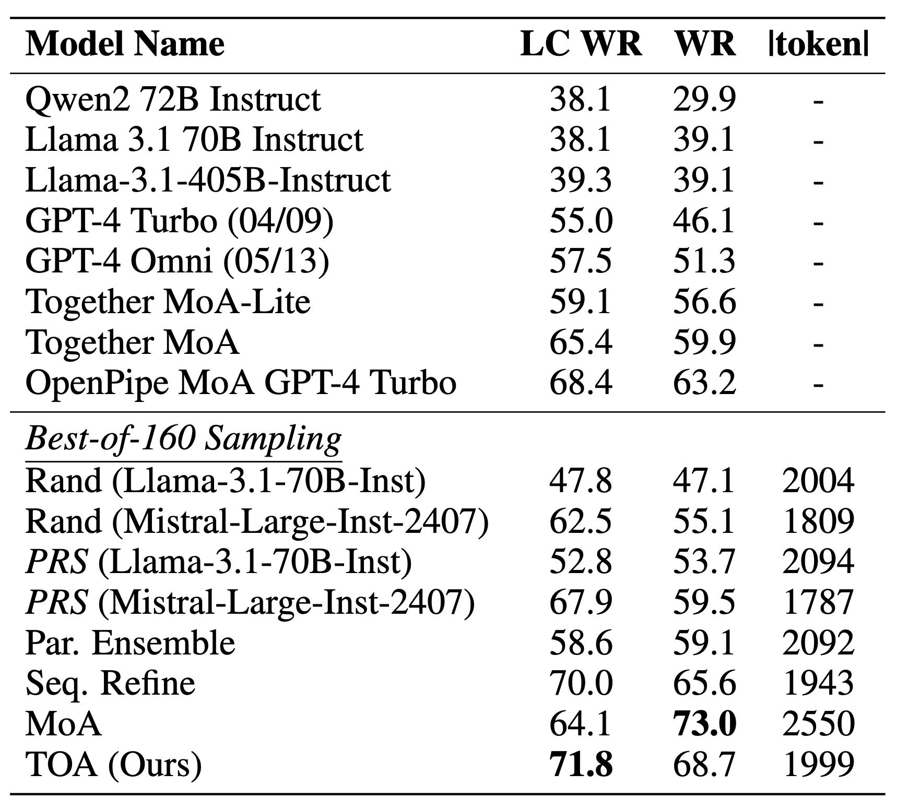
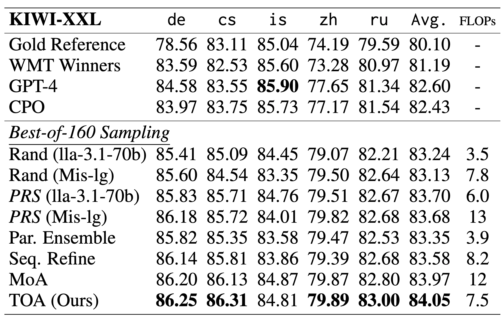
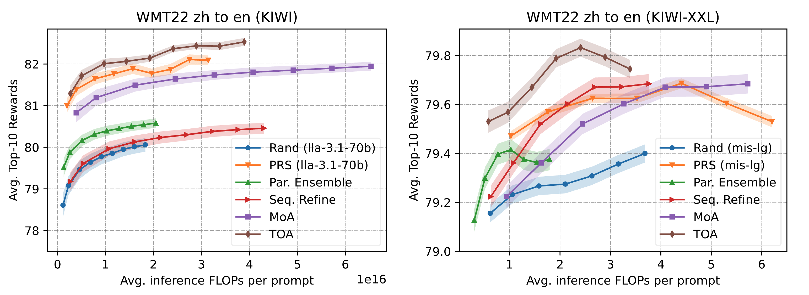
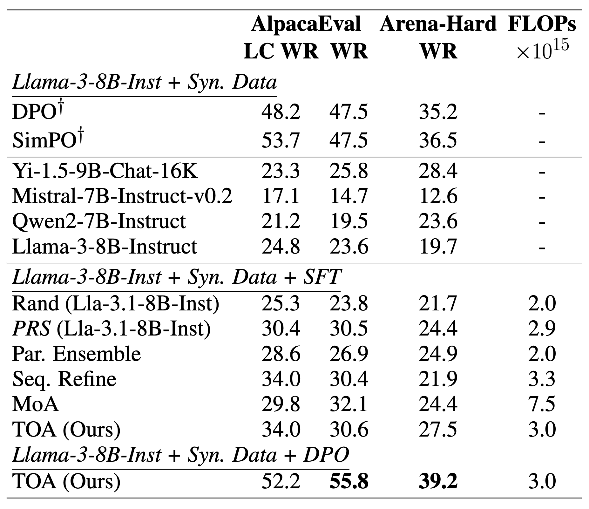

# TOA: Tree Search-based Orchestrated Agents


<!-- <div style="text-align: center;">
  
  <br>
  <a href="https://arxiv.org/pdf/2412.17061" style="text-decoration: none;"> 
  </a>
  <a href="https://github.com/oceanypt/TOA-Lite/tree/main?tab=Apache-2.0-1-ov-file" style="text-decoration: none;"> 
  </a>
</div> -->

<div style="text-align: center;">
  
  <br>
</div>

[](https://arxiv.org/pdf/2412.17061)
[](LICENSE)


This is officical repository for the work [Multi-Agent Sampling: Scaling Inference Compute for Data Synthesis with Tree Search-Based Agentic Collaboration](https://arxiv.org/pdf/2412.17061). We study how to synthesize data for alignment from multiple distinct language models such as Llama3, Qwen2, Mistral, etc, which is so called problem of multi-agent sampling. We propose [TOA]() (Tree Search-based Orchestrated Agents) to achieve this goal. Our method is driven by Monte Carlo Tree Search with a Reward Model integrated. 


**TOA** is designed to **synthesize alignment data** (specifically the output responses) from a diverse range of language models. 


## 🌟 Key Features

- 🔓 **Open-source models**: [Llama Series](https://huggingface.co/meta-llama), [Qwen Series](https://huggingface.co/Qwen), [Mistral Series](https://huggingface.co/mistralai), and more.
- 🔒 **Closed-source models**: OpenAI, Claude, etc.
- 😊 **OpenAI Compatible Server**: We support OpenAI compatible API to use the models. 
- 🎯 **Reward Model Integration**: TOA utilizes a reward model to guide and optimize the generation process. You can easily specifiy a your own reward model.
- 💰 **Compute Efficient**: For each input question, TOA optimizes the generation structure dynamically with MCTS-based search, making our method more compute-efficient than other baselines for data synthesis. 
- 📣 **Support Various Methods**: Our repository implements various methods for single- and multi-agent sampling.


## Supported Methods


| Method            | Paper                                                                 | Example Code                                                                  |
|-------------------|----------------------------------------------------------------------|-------------------------------------------------------------------------------|
| Random Sampling   | [Link](https://arxiv.org/abs/2407.21787)                             | [bash](bash/exp_alpaca_eval/run_generate.api.ensemble.pre_load.sh)            |
| PRS               | [Link](https://arxiv.org/abs/2408.12163)                             | [bash](bash/exp_alpaca_eval/run_generate.api.prs.pre_load.sh)                 |
| Parallel Ensemble | [Link]()                                                             | [bash](bash/exp_alpaca_eval/run_generate.api.ensemble.pre_load.sh)            |
| Sequential Refine | [Link](https://arxiv.org/abs/2408.03314)                             | [bash](bash/exp_alpaca_eval/run_generate.api.ensemble_seq.pre_load.sh)        |
| MoA               | [Link](https://arxiv.org/abs/2406.04692)                             | [bash](bash/exp_alpaca_eval/run_generate.api.moa.pre_load.sh)                 |
| TOA (ours)        | [Link](https://arxiv.org/abs/2412.17061)                             | [bash](bash/exp_alpaca_eval/run_generate.api.mcts.pre_load.sh)                |


Random sampling and PRS are single-agent based methods. 


## Synthesized Alignment Data

We synthesized data from the following four language models and the reward model. The input prompts are taken from [Ultrafeedback](princeton-nlp/llama3-ultrafeedback-armorm). For each prompt, we sample 160 responses. We keep the best response with the highest reward to build SFT data. For DPO training, we select the ranked 30th response as the rejected sample and best one as the chosen sample. 
|Models                                                                                      |Reward Model                                                                                 |SFT Data                                                                                               |DPO Data                                                                                     |
|--------------------------------------------------------------------------------------------|---------------------------------------------------------------------------------------------|---------------------------------------------------------------------------------------------------------------------|------------------------------------------------------------------------------------------------------------|
| [Llama-3.1-8B-Instruct](https://huggingface.co/meta-llama/Llama-3.1-8B-Instruct)           | [ArmoRM-Llama3-8B-v0.1](https://huggingface.co/RLHFlow/ArmoRM-Llama3-8B-v0.1)              | [Rand-Qwen2-7B-Inst](https://huggingface.co/datasets/oceanpty/TOA-Ultrafeedback-SFT-Rand-qwen2-7b-inst)             | [TOA](https://huggingface.co/datasets/oceanpty/TOA-Ultrafeedback-DPO-TOA-model-num-4)                      |
| [Qwen2-7B-Instruct](https://huggingface.co/Qwen/Qwen2-7B-Instruct)                         |                                                                                             | [Rand-Lla3.1-8B-Inst](https://huggingface.co/datasets/oceanpty/TOA-Ultrafeedback-SFT-Rand-lla3.1-8b-inst)            |                                                                                                            |
| [Mistral-7B-Instruct-v0.2](https://huggingface.co/mistralai/Mistral-7B-Instruct-v0.2)      |                                                                                             | [PRS-Qwen2-7B-Inst](https://huggingface.co/datasets/oceanpty/TOA-Ultrafeedback-SFT-PRS-qwen2-7b-inst)               |                                                                                                            |
| [Yi-1.5-9B-Chat-16K](https://huggingface.co/01-ai/Yi-1.5-9B-Chat-16K)                      |                                                                                             | [PRS-Lla3.1-8B-Inst](https://huggingface.co/datasets/oceanpty/TOA-Ultrafeedback-SFT-PRS-lla3.1-8b-inst)             |                                                                                                            |
|                                                                                            |                                                                                             | [Par.Eesemble](https://huggingface.co/datasets/oceanpty/TOA-Ultrafeedback-SFT-Ensemble-model-num-4)                 |                                                                                                            |
|                                                                                            |                                                                                             | [SeqRefine](https://huggingface.co/datasets/oceanpty/TOA-Ultrafeedback-SFT-SeqRefine-model-num-4)                   |                                                                                                            |
|                                                                                            |                                                                                             | [MoA](https://huggingface.co/datasets/oceanpty/TOA-Ultrafeedback-SFT-MoA-model-num-4)                               |                                                                                                            |
|                                                                                            |                                                                                             | [TOA](https://huggingface.co/datasets/oceanpty/TOA-Ultrafeedback-SFT-TOA-model-num-4)                               |                                                                                                            |


<!-- ## Project Directory Structure

- **README.md**
  - Provides an introduction to the project, usage instructions, and documentation.

- **LICENSE**
  - Contains the project license, outlining the rules and permissions for using the project.

- **.DS_Store**
  - A temporary file automatically generated by macOS. It's not part of the core project and should be ignored.

- **bash/**
  - Contains scripts for automation, environment setup, or other command-line utilities.

- **chat_templates/**
  - Includes predefined templates for dialogues or interactions, likely used in Natural Language Processing (NLP) tasks.

- **code/**
  - The core code directory, containing scripts for training, testing, and evaluating models.

- **data/**
  - Stores project datasets, including training, testing, or intermediate processed data.

- **figures/**
  - A directory for storing visualizations, such as charts, graphs, or results.

- **model_configs/**
  - Contains model configuration files, such as parameter settings and architecture definitions.

- **useful_code/**
  - Holds utility scripts or helpful tools to support the project, such as debugging or preprocessing tools.
 -->


## News
- [2024/12/22] [TOA paper](https://arxiv.org/pdf/2412.17061) is out at arXiv. 


## Quick Start

### 1. Start Local Servers
If you want to host the language models locally, you can use the provide the code to start the local servers. 

```bash
cd bash/launch_large_models

python start_server.vllm.py path_to_config root_to_save GPU port gpu_utilize
```


- path_to_config: path to the configuration file of the model, which is in JSON format and looks like
```bash
{
    "policy_model": {
            "llama-3.1-8b-instruct": {
                "path_to_model": "",
                "path_to_chat_template": "../chat_templates/llama-3.1-instruct.jinja",
                "stop_tokens": "['<|eot_id|>']"
        }
    }
}
```
- root_to_save: path to save the server configuration, which is in JSON format and looks like:
```bash

    "model_name": "llama-3.1-8b-instruct",
    "config": {
        "path_to_model": "",
        "path_to_chat_template": "../chat_templates/llama-3.1-instruct.jinja",
        "stop_tokens": "['<|eot_id|>']",
        "api_key": "abc123",
        "port": e.g., 8000,
        "host": the local machine address,
        "GPU": e.g., "0",
        "gpu_utilize": e.g., 0.9
    }
}
```
- GPU: gpu ids, such as "0", "0,1", "0,1,2,3"
- port: 8000, 8001, etc
- gpu_utilize: how much gpu memory to use, such as 0.9, 0.8

You can start the server for different models, just make sure to save all the server configuration into one same folder, that is [root_to_save](). 


### 2. Reward Model
A reward model is needed to generate rewards for generated responses in the real time. 

We need to specify the configurations for the reward model in the JSON format, 
```bash
cd model_configs
```
which is like:
```bash
{
    "reward_model": {"name": "ArmoRM", "path": "", "GPU": "0" }
}
```

For the personalized model, you may need to revise the code [code/reward.py](./code/reward.py). You need to specify how the reward model can be used for reward calculation. 


### 3. Start Data Synthesis
Now, we can start data generation!
```bash
cd bash
cd exp_alpaca_eval
bash run_generate.api.mcts.pre_load.sh
```
After generation completion, you will get multiple responses for each input prompt. Each response has a reward, which can be used to do reject sampling or best-of-N sampling. 


## Results
<table style="border: none; width: 100%;">
  <tr>
    <td align="center">
      
      <br>
      (a) Result of AlpacaEval 2.0
    </td>
    <td align="center">
      
      <br>
      (b) Result of WMT'22.
    </td>
  </tr>
   <tr>
    <td align="center" colspan="2">
      
      <br>
      (c) Scaling results on AlpacaEval.
    </td>
  </tr>
  <tr>
    <td align="center" colspan="2">
      
      <br>
      (d) Effectiveness of synthetic alignment data.
    </td>
  </tr>
</table>

### 1. AlpacaEval v2.0
We combine five language models to conduct best-of-160 sampling: [Llama-3.1-70B-Instruct](https://huggingface.co/meta-llama/Llama-3.1-70B-Instruct), [Mistral-Large-Instruct-2407](https://huggingface.co/mistralai/Mistral-Large-Instruct-2407), [Qwen2-72B-Instruct](https://huggingface.co/Qwen/Qwen2-72B-Instruct), [Mixtral-8x22B-Instruct-v0.1](https://huggingface.co/mistralai/Mixtral-8x22B-Instruct-v0.1), and [Wizardlm-2-8x22b](https://huggingface.co/alpindale/WizardLM-2-8x22B). The reward model is [ArmoRM-Llama3-8B-v0.1](https://huggingface.co/RLHFlow/ArmoRM-Llama3-8B-v0.1). The result is shown in Fig.(a). 

To evaluate for AlpacaEval v2.0:
```bash
cd bash/exp_alpaca_eval

TOA: bash run_generate.api.mcts.pre_load.sh 
MoA: bash run_generate.api.moa.pre_load.sh 
Seq. Refine: bash run_generate.api.ensemble_seq.pre_load.sh 
Ensemble: bash run_generate.api.ensemble.pre_load.sh
PRS: bash run_generate.api.prs.pre_load.sh 
```


### 2. WMT'22
We also use the above large language models for best-of-160 sampling. The reward model now becomes [KIWI](https://huggingface.co/Unbabel/wmt22-cometkiwi-da). The results are shown in Fig.(b), where the metrics are [KIWI-XXL](https://huggingface.co/Unbabel/wmt23-cometkiwi-da-xxl). 

To evaluate for WMT'22:
```
cd bash/exp_nmt
```


### 3. Scaling Inference Compute
We present the results of scaling inference compute in Fig.(c). Left using [ArmoRM-Llama3-8B-v0.1](https://huggingface.co/RLHFlow/ArmoRM-Llama3-8B-v0.1) as the reward model for generation and evaluation. Right further using GPT-4 for another round of evaluation on the best response with the highest Armo Reward. 


## Citation
```bibtex
@misc{ye2024multiagentsamplingscalinginference,
      title={Multi-Agent Sampling: Scaling Inference Compute for Data Synthesis with Tree Search-Based Agentic Collaboration}, 
      author={Hai Ye and Mingbao Lin and Hwee Tou Ng and Shuicheng Yan},
      year={2024},
      eprint={2412.17061},
      archivePrefix={arXiv},
      primaryClass={cs.CL},
      url={https://arxiv.org/abs/2412.17061}, 
}
```


