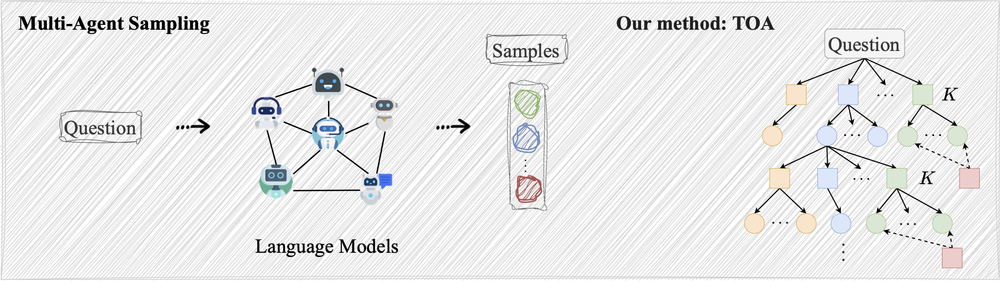
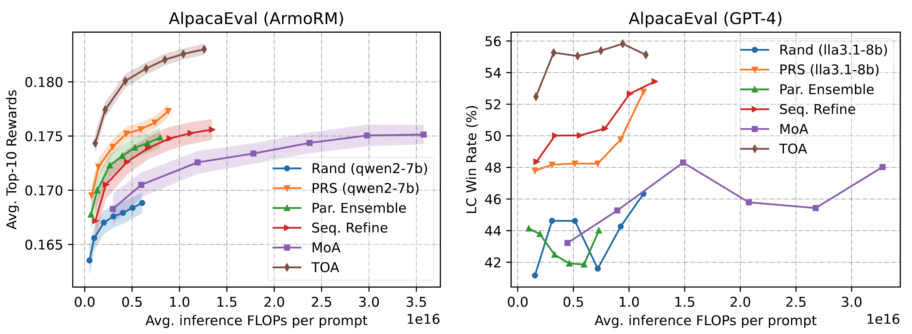

# TOA: Tree Search-based Orchestrated Agents

<div style="text-align: center;">
  
  <br>
</div>

[](https://arxiv.org/pdf/2412.17061)
[](LICENSE)


<!-- This is officical repository for the work [Multi-Agent Sampling: Scaling Inference Compute for Data Synthesis with Tree Search-Based Agentic Collaboration](https://arxiv.org/pdf/2412.17061). We study how to synthesize data for alignment from multiple distinct language models such as Llama3, Qwen2, Mistral, etc, which is so called problem of multi-agent sampling. We propose [TOA]() (Tree Search-based Orchestrated Agents) to achieve this goal. Our method is driven by Monte Carlo Tree Search with a Reward Model integrated. 


**TOA** is designed to **synthesize alignment data** (specifically the output responses) from a diverse range of language models. 
 -->


Welcome to the official repository for the work [**Multi-Agent Sampling: Scaling Inference Compute for Data Synthesis with Tree Search-Based Agentic Collaboration**](https://arxiv.org/pdf/2412.17061). 

In this work, we tackle the challenge of synthesizing alignment data from multiple distinct language models, such as Llama3, Qwen2, Mistral, and others—an approach known as **multi-agent sampling**. To address this problem, we introduce [**TOA**](), a novel method leveraging **Tree Search-based Orchestrated Agents**.

Our approach integrates **Monte Carlo Tree Search (MCTS)** with a **Reward Model** to optimize collaboration among diverse language models, ensuring high-quality alignment data synthesis.
<!-- 
## **About TOA**

**TOA** is specifically designed to:
- Facilitate the synthesis of alignment data, particularly high-quality response outputs.
- Collaborate effectively with a diverse set of language models to ensure robust and scalable data synthesis.
- Harness the power of **tree search techniques** for orchestrating agentic interactions among models.


## 🌟 Key Features

- 🔓 **Open-source models**: [Llama Series](https://huggingface.co/meta-llama), [Qwen Series](https://huggingface.co/Qwen), [Mistral Series](https://huggingface.co/mistralai), and more.
- 🔒 **Closed-source models**: OpenAI, Claude, etc.
- 😊 **OpenAI Compatible Server**: We support OpenAI compatible API to use the models. 
- 🎯 **Reward Model Integration**: TOA utilizes a reward model to guide and optimize the generation process. You can easily specifiy a your own reward model.
- 💰 **Compute Efficient**: For each input question, TOA optimizes the generation structure dynamically with MCTS-based search, making our method more compute-efficient than other baselines for data synthesis. 
- 📣 **Support Various Methods**: Our repository implements various methods for single- and multi-agent sampling. -->


## News
- [2024/12/22] [TOA paper](https://arxiv.org/pdf/2412.17061) is out at arXiv. 


## Quick Links
- [Key Features](#-key-features) 
- [Supported Methods](#supported-methods)
- [Supported LLMs and Reward Models](#supported-llms-and-reward-models)
- [Synthesized Alignment Data](#synthesized-alignment-data)
- [Quick Start](#quick-start)
- [Results](#results)
- [Citation](#citation)


## 🌟 Key Features

This repository introduces [**TOA**](#), a framework for multi-agent sampling to synthesize high-quality alignment data from diverse language models:

### 🚀 **TOA Overview**
- **Alignment Data Synthesis**: Generates high-quality responses from multiple language models.
- **Agent Collaboration**: Coordinates diverse models for scalable and robust data synthesis.
- **Monte Carlo Tree Search (MCTS)**: Optimizes response generation using MCTS with a reward model.

### 🔑 **Highlights**
- 😊 **Universal Model Compatibility**: Fully compatible with any model offering OpenAI-like APIs:
  - 🔓 **Open-source Models**: Compatible with [Llama](https://huggingface.co/meta-llama), [Qwen](https://huggingface.co/Qwen), [Mistral](https://huggingface.co/mistralai), and others.
  - 🔒 **Closed-source Models**: Works with proprietary models such as OpenAI, Claude, and more.
- 🎯 **Reward Model Integration**: Allows custom reward models to guide generation.
- 💰 **Compute Efficient**: Uses MCTS for efficient computation and response generation.
- 📣 **Flexible Sampling Methods**: Supports both single-agent and multi-agent sampling.


<!-- 
## Supported Methods


| Method            | Paper                                                                 | Example Code                                                                  |
|:-------------------|:----------------------------------------------------------------------|:-------------------------------------------------------------------------------|
| Random Sampling   | [Link](https://arxiv.org/abs/2407.21787)                             | [bash](bash/exp_alpaca_eval/run_generate.api.ensemble.pre_load.sh)            |
| PRS               | [Link](https://arxiv.org/abs/2408.12163)                             | [bash](bash/exp_alpaca_eval/run_generate.api.prs.pre_load.sh)                 |
| Parallel Ensemble | [Link]()                                                             | [bash](bash/exp_alpaca_eval/run_generate.api.ensemble.pre_load.sh)            |
| Sequential Refine | [Link](https://arxiv.org/abs/2408.03314)                             | [bash](bash/exp_alpaca_eval/run_generate.api.ensemble_seq.pre_load.sh)        |
| MoA               | [Link](https://arxiv.org/abs/2406.04692)                             | [bash](bash/exp_alpaca_eval/run_generate.api.moa.pre_load.sh)                 |
| TOA (ours)        | [Link](https://arxiv.org/abs/2412.17061)                             | [bash](bash/exp_alpaca_eval/run_generate.api.mcts.pre_load.sh)                |


Random sampling and PRS are single-agent based methods.  -->


## Supported Methods


The table below summarizes the key methods supported in this repository, along with references to their respective papers and example code:

| **Method**         | **Paper**                                                             | **Example Code**                                                               |
|:--------------------|:----------------------------------------------------------------------|:-------------------------------------------------------------------------------|
| **Random Sampling** | [Link](https://arxiv.org/abs/2407.21787)                             | [bash](bash/exp_alpaca_eval/run_generate.api.ensemble.pre_load.sh)            |
| **PRS**             | [Link](https://arxiv.org/abs/2408.12163)                             | [bash](bash/exp_alpaca_eval/run_generate.api.prs.pre_load.sh)                 |
| **Parallel Ensemble** | [Link]()                                                            | [bash](bash/exp_alpaca_eval/run_generate.api.ensemble.pre_load.sh)            |
| **Sequential Refine** | [Link](https://arxiv.org/abs/2408.03314)                           | [bash](bash/exp_alpaca_eval/run_generate.api.ensemble_seq.pre_load.sh)        |
| **MoA**             | [Link](https://arxiv.org/abs/2406.04692)                             | [bash](bash/exp_alpaca_eval/run_generate.api.moa.pre_load.sh)                 |
| **TOA (Ours)**      | [Link](https://arxiv.org/abs/2412.17061)                             | [bash](bash/exp_alpaca_eval/run_generate.api.mcts.pre_load.sh)                |

### Notes:
- **Random Sampling** and **PRS** are single-agent-based methods.
- **TOA** represents our novel approach, integrating Monte Carlo Tree Search (MCTS) to optimize multi-agent collaboration.


<!-- ## Supported LLMs and Reward Models
We have tested the following open-source language models and reward models. 

| LLM Group 1 | LLM Group 2 |
|:-------------|:-------------|
| [Llama-3.1-8B-Instruct](https://huggingface.co/meta-llama/Llama-3.1-8B-Instruct) | [Llama-3.1-70B-Instruct](https://huggingface.co/meta-llama/Llama-3.1-70B-Instruct) |
| [Qwen2-7B-Instruct](https://huggingface.co/Qwen/Qwen2-7B-Instruct) | [Mistral-Large-Instruct-2407](https://huggingface.co/mistralai/Mistral-Large-Instruct-2407) |
| [Mistral-7B-Instruct-v0.2](https://huggingface.co/mistralai/Mistral-7B-Instruct-v0.2) | [Qwen2-72B-Instruct](https://huggingface.co/Qwen/Qwen2-72B-Instruct) |
| [Yi-1.5-9B-Chat-16K](https://huggingface.co/01-ai/Yi-1.5-9B-Chat-16K) | [Mixtral-8x22B-Instruct-v0.1](https://huggingface.co/mistralai/Mixtral-8x22B-Instruct-v0.1) |
|             | [Wizardlm-2-8x22b](https://huggingface.co/alpindale/WizardLM-2-8x22B) |

| Reward Models |
|:---------------|
| [Skywork-Reward-Llama-3.1-8B-v0.2](https://huggingface.co/Skywork/Skywork-Reward-Llama-3.1-8B-v0.2) |
| [Skywork-Reward-Gemma-2-27B-v0.2](https://huggingface.co/Skywork/Skywork-Reward-Gemma-2-27B-v0.2) |
| [ArmoRM-Llama3-8B-v0.1](https://huggingface.co/RLHFlow/ArmoRM-Llama3-8B-v0.1) | -->


## Supported LLMs and Reward Models

We have tested the following open-source language models (LLMs) and reward models in our framework:

### **Tested Language Models**
The LLMs are grouped below for clarity and ease of reference:

| **LLM Group 1**                                                                 | **LLM Group 2**                                                                 |
|:--------------------------------------------------------------------------------|:--------------------------------------------------------------------------------|
| [Llama-3.1-8B-Instruct](https://huggingface.co/meta-llama/Llama-3.1-8B-Instruct) | [Llama-3.1-70B-Instruct](https://huggingface.co/meta-llama/Llama-3.1-70B-Instruct) |
| [Qwen2-7B-Instruct](https://huggingface.co/Qwen/Qwen2-7B-Instruct)               | [Mistral-Large-Instruct-2407](https://huggingface.co/mistralai/Mistral-Large-Instruct-2407) |
| [Mistral-7B-Instruct-v0.2](https://huggingface.co/mistralai/Mistral-7B-Instruct-v0.2) | [Qwen2-72B-Instruct](https://huggingface.co/Qwen/Qwen2-72B-Instruct)           |
| [Yi-1.5-9B-Chat-16K](https://huggingface.co/01-ai/Yi-1.5-9B-Chat-16K)           | [Mixtral-8x22B-Instruct-v0.1](https://huggingface.co/mistralai/Mixtral-8x22B-Instruct-v0.1) |
|                                                                                 | [Wizardlm-2-8x22B](https://huggingface.co/alpindale/WizardLM-2-8x22B)          |

### **Tested Reward Models**
The following reward models have been evaluated in our experiments:

| **Reward Models**                                                                                      |
|:-------------------------------------------------------------------------------------------------------|
| [Skywork-Reward-Llama-3.1-8B-v0.2](https://huggingface.co/Skywork/Skywork-Reward-Llama-3.1-8B-v0.2)     |
| [Skywork-Reward-Gemma-2-27B-v0.2](https://huggingface.co/Skywork/Skywork-Reward-Gemma-2-27B-v0.2)       |
| [ArmoRM-Llama3-8B-v0.1](https://huggingface.co/RLHFlow/ArmoRM-Llama3-8B-v0.1)                           |


<!-- ## Synthesized Alignment Data

We synthesized data from the following four language models and the reward model. The input prompts are taken from [Ultrafeedback](princeton-nlp/llama3-ultrafeedback-armorm). For each prompt, we sample 160 responses. We keep the best response with the highest reward to build SFT data. For DPO training, we select the ranked 30th response as the rejected sample and best one as the chosen sample. 
|Models                                                                                      |Reward Model                                                                                 |SFT Data                                                                                               |DPO Data                                                                                     |
|:--------------------------------------------------------------------------------------------|:---------------------------------------------------------------------------------------------|:---------------------------------------------------------------------------------------------------------------------|:------------------------------------------------------------------------------------------------------------|
| [Llama-3.1-8B-Instruct](https://huggingface.co/meta-llama/Llama-3.1-8B-Instruct)           | [ArmoRM-Llama3-8B-v0.1](https://huggingface.co/RLHFlow/ArmoRM-Llama3-8B-v0.1)              | [Rand-Qwen2-7B-Inst](https://huggingface.co/datasets/oceanpty/TOA-Ultrafeedback-SFT-Rand-qwen2-7b-inst)             | [TOA](https://huggingface.co/datasets/oceanpty/TOA-Ultrafeedback-DPO-TOA-model-num-4)                      |
| [Qwen2-7B-Instruct](https://huggingface.co/Qwen/Qwen2-7B-Instruct)                         |                                                                                             | [Rand-Lla3.1-8B-Inst](https://huggingface.co/datasets/oceanpty/TOA-Ultrafeedback-SFT-Rand-lla3.1-8b-inst)            |                                                                                                            |
| [Mistral-7B-Instruct-v0.2](https://huggingface.co/mistralai/Mistral-7B-Instruct-v0.2)      |                                                                                             | [PRS-Qwen2-7B-Inst](https://huggingface.co/datasets/oceanpty/TOA-Ultrafeedback-SFT-PRS-qwen2-7b-inst)               |                                                                                                            |
| [Yi-1.5-9B-Chat-16K](https://huggingface.co/01-ai/Yi-1.5-9B-Chat-16K)                      |                                                                                             | [PRS-Lla3.1-8B-Inst](https://huggingface.co/datasets/oceanpty/TOA-Ultrafeedback-SFT-PRS-lla3.1-8b-inst)             |                                                                                                            |
|                                                                                            |                                                                                             | [Par.Eesemble](https://huggingface.co/datasets/oceanpty/TOA-Ultrafeedback-SFT-Ensemble-model-num-4)                 |                                                                                                            |
|                                                                                            |                                                                                             | [SeqRefine](https://huggingface.co/datasets/oceanpty/TOA-Ultrafeedback-SFT-SeqRefine-model-num-4)                   |                                                                                                            |
|                                                                                            |                                                                                             | [MoA](https://huggingface.co/datasets/oceanpty/TOA-Ultrafeedback-SFT-MoA-model-num-4)                               |                                                                                                            |
|                                                                                            |                                                                                             | [TOA](https://huggingface.co/datasets/oceanpty/TOA-Ultrafeedback-SFT-TOA-model-num-4)                               |                                                                                                            |
 -->


 ## Synthesized Alignment Data

We synthesized alignment data using the following four language models and a reward model. The input prompts were sourced from [Ultrafeedback](https://huggingface.co/princeton-nlp/llama3-ultrafeedback-armorm). For each prompt:
- **160 responses** were sampled.
- The **best response** with the highest reward was selected for **SFT data**.
- For **DPO training**, the **ranked 30th response** was used as the rejected sample, and the best response was used as the chosen sample.

### **Synthesized Data Summary**

| **Models**                                                                                 | **Reward Model**                                                                        | **SFT Data**                                                                                       | **DPO Data**                                                                                   |
|:------------------------------------------------------------------------------------------|:---------------------------------------------------------------------------------------|:---------------------------------------------------------------------------------------------------|:------------------------------------------------------------------------------------------------|
| [Llama-3.1-8B-Instruct](https://huggingface.co/meta-llama/Llama-3.1-8B-Instruct)          | [ArmoRM-Llama3-8B-v0.1](https://huggingface.co/RLHFlow/ArmoRM-Llama3-8B-v0.1)          | [Rand-Qwen2-7B-Inst](https://huggingface.co/datasets/oceanpty/TOA-Ultrafeedback-SFT-Rand-qwen2-7b-inst) | [TOA](https://huggingface.co/datasets/oceanpty/TOA-Ultrafeedback-DPO-TOA-model-num-4)          |
| [Qwen2-7B-Instruct](https://huggingface.co/Qwen/Qwen2-7B-Instruct)                        |                                                                                         | [Rand-Lla3.1-8B-Inst](https://huggingface.co/datasets/oceanpty/TOA-Ultrafeedback-SFT-Rand-lla3.1-8b-inst) |                                                                                                 |
| [Mistral-7B-Instruct-v0.2](https://huggingface.co/mistralai/Mistral-7B-Instruct-v0.2)     |                                                                                         | [PRS-Qwen2-7B-Inst](https://huggingface.co/datasets/oceanpty/TOA-Ultrafeedback-SFT-PRS-qwen2-7b-inst) |                                                                                                 |
| [Yi-1.5-9B-Chat-16K](https://huggingface.co/01-ai/Yi-1.5-9B-Chat-16K)                     |                                                                                         | [PRS-Lla3.1-8B-Inst](https://huggingface.co/datasets/oceanpty/TOA-Ultrafeedback-SFT-PRS-lla3.1-8b-inst) |                                                                                                 |
|                                                                                           |                                                                                         | [Par. Ensemble](https://huggingface.co/datasets/oceanpty/TOA-Ultrafeedback-SFT-Ensemble-model-num-4)  |                                                                                                 |
|                                                                                           |                                                                                         | [SeqRefine](https://huggingface.co/datasets/oceanpty/TOA-Ultrafeedback-SFT-SeqRefine-model-num-4)    |                                                                                                 |
|                                                                                           |                                                                                         | [MoA](https://huggingface.co/datasets/oceanpty/TOA-Ultrafeedback-SFT-MoA-model-num-4)               |                                                                                                 |
|                                                                                           |                                                                                         | [TOA](https://huggingface.co/datasets/oceanpty/TOA-Ultrafeedback-SFT-TOA-model-num-4)               |                                                                                                 |

### Key Notes:
- **SFT Data**: The best response from the sampled 160 responses is used for supervised fine-tuning.
- **DPO Data**: The 30th ranked response serves as the rejected sample, while the top response is used as the accepted sample.
- Explore the provided links for detailed datasets and models.


## Quick Start

### 0. Requirement
We primarily require [vLLM](https://docs.vllm.ai/en/latest/getting_started/installation.html) to be installed to ensure efficient and fast model inference for our code. Please make sure that vLLM is installed on your machine. Alternatively, other toolkits like Sglang can also be used.


<!-- 
### 1. Start Local Servers
If you want to host the language models locally, you can use the provide the code to start the local servers. 

```bash
cd bash/launch_large_models

python start_server.vllm.py path_to_config root_to_save GPU port gpu_utilize
```


- path_to_config: path to the configuration file of the model, which is in JSON format and looks like
```bash
{
    "policy_model": {
            "llama-3.1-8b-instruct": {
                "path_to_model": "",
                "path_to_chat_template": "../chat_templates/llama-3.1-instruct.jinja",
                "stop_tokens": "['<|eot_id|>']"
        }
    }
}
```
- root_to_save: path to save the server configuration, which is in JSON format and looks like:
```bash

    "model_name": "llama-3.1-8b-instruct",
    "config": {
        "path_to_model": "",
        "path_to_chat_template": "../chat_templates/llama-3.1-instruct.jinja",
        "stop_tokens": "['<|eot_id|>']",
        "api_key": "abc123",
        "port": e.g., 8000,
        "host": the local machine address,
        "GPU": e.g., "0",
        "gpu_utilize": e.g., 0.9
    }
}
```
- GPU: gpu ids, such as "0", "0,1", "0,1,2,3"
- port: 8000, 8001, etc
- gpu_utilize: how much gpu memory to use, such as 0.9, 0.8

You can start the server for different models, just make sure to save all the server configuration into one same folder, that is [root_to_save](). 
 -->


### 1. Start Local Servers

If you want to host language models locally, you can use the provided code to start local servers.

#### **Steps to Start the Server**
Navigate to the directory and run the following command:

```bash
cd bash/launch_large_models

python start_server.vllm.py path_to_config root_to_save GPU port gpu_utilize
```
##### Parameter Descriptions

- path_to_config: Path to the model configuration file (in JSON format). Example:
```json
{
    "policy_model": {
        "llama-3.1-8b-instruct": {
            "path_to_model": "",
            "path_to_chat_template": "../chat_templates/llama-3.1-instruct.jinja",
            "stop_tokens": "['<|eot_id|>']"
        }
    }
}
```
- root_to_save: Path to save the server configuration (in JSON format). Example:
```json
{
    "model_name": "llama-3.1-8b-instruct",
    "config": {
        "path_to_model": "",
        "path_to_chat_template": "../chat_templates/llama-3.1-instruct.jinja",
        "stop_tokens": "['<|eot_id|>']",
        "api_key": "abc123",
        "port": 8000,
        "host": "localhost",
        "GPU": "0",
        "gpu_utilize": 0.9
    }
}
```
- GPU: GPU IDs to use, e.g., "0", "0,1", or "0,1,2,3".
- port: Port number for the server, e.g., 8000, 8001, etc.
- gpu_utilize: Percentage of GPU memory to use, e.g., 0.9 for 90%.

### Notes
- You can start servers for different models using this script.
- Ensure that all server configurations are saved in the same directory (specified by [root_to_save]()).

By following these steps, you can run multiple local servers for hosting language models seamlessly.

<!-- 
### 2. Reward Model
A reward model is needed to generate rewards for generated responses in the real time. 

We need to specify the configurations for the reward model in the JSON format, 
```bash
cd model_configs
```
which is like:
```bash
{
    "reward_model": {"name": "ArmoRM", "path": "", "GPU": "0" }
}
```

For the personalized model, you may need to revise the code [code/reward.py](./code/reward.py). You need to specify how the reward model can be used for reward calculation.  -->


以下是优化后的内容，将语言调整为更流畅且结构更加清晰的 Markdown 格式：

### 2. Reward Model

A reward model is required to generate real-time rewards for the generated responses.

#### **Steps to Configure the Reward Model**
1. Navigate to the `model_configs` directory:
```bash
cd model_configs
```
2.	Provide the configuration file in JSON format. An example configuration looks like this:
```json
{
    "reward_model": {
        "name": "ArmoRM",
        "path": "",
        "GPU": "0"
    }
}
```

#### Customization for Personalized Models

If you need to use a personalized reward model, update the code in the following file:
- code/reward.py

Within this file, you must specify how the reward model will be used for reward calculation. Ensure the implementation aligns with your specific model’s requirements.

By following these steps, you can easily integrate and customize the reward model for your needs.


<!-- ### 3. Start Data Synthesis
Now, we can start data generation!
```bash
cd bash
cd exp_alpaca_eval
bash run_generate.api.mcts.pre_load.sh
```
After generation completion, you will get multiple responses for each input prompt. Each response has a reward, which can be used to do reject sampling or best-of-N sampling.  -->


### 3. Start Data Synthesis

You are now ready to start generating data! Follow the steps below:

#### **Steps to Run Data Synthesis**
1. Navigate to the experiment directory:
```bash
cd bash
cd exp_alpaca_eval
```
2.	Run the provided script to start the synthesis process:
```bash 
bash run_generate.api.mcts.pre_load.sh
```

**What Happens Next**
- After the generation is complete, you will obtain multiple responses for each input prompt.
- Each response is associated with a reward, which can be used for:
    - Reject Sampling: Filter out lower-quality responses.
    - Best-of-N Sampling: Select the highest-quality response from the generated samples.

By following these steps, you can efficiently generate alignment data tailored to your requirements.


## Results
<table style="border: none; width: 100%;">
  <tr>
    <td align="center">
      
      <br>
      (a) Result of AlpacaEval 2.0
    </td>
    <td align="center">
      
      <br>
      (b) Result of WMT'22.
    </td>
  </tr>
   <tr>
    <td align="center" colspan="2">
      
      <br>
      (c) Scaling results on AlpacaEval.
    </td>
  </tr>
  <tr>
    <td align="center" colspan="2">
      
      <br>
      (d) Effectiveness of synthetic alignment data.
    </td>
  </tr>
</table>

### 1. AlpacaEval v2.0
<!-- We combine five language models to conduct best-of-160 sampling: [Llama-3.1-70B-Instruct](https://huggingface.co/meta-llama/Llama-3.1-70B-Instruct), [Mistral-Large-Instruct-2407](https://huggingface.co/mistralai/Mistral-Large-Instruct-2407), [Qwen2-72B-Instruct](https://huggingface.co/Qwen/Qwen2-72B-Instruct), [Mixtral-8x22B-Instruct-v0.1](https://huggingface.co/mistralai/Mixtral-8x22B-Instruct-v0.1), and [Wizardlm-2-8x22b](https://huggingface.co/alpindale/WizardLM-2-8x22B). The reward model is [ArmoRM-Llama3-8B-v0.1](https://huggingface.co/RLHFlow/ArmoRM-Llama3-8B-v0.1). The result is shown in Fig. (a). 
 -->

We utilize a combination of five advanced language models to perform best-of-160 sampling:

- [**Llama-3.1-70B-Instruct**](https://huggingface.co/meta-llama/Llama-3.1-70B-Instruct)
- [**Mistral-Large-Instruct-2407**](https://huggingface.co/mistralai/Mistral-Large-Instruct-2407)
- [**Qwen2-72B-Instruct**](https://huggingface.co/Qwen/Qwen2-72B-Instruct)
- [**Mixtral-8x22B-Instruct-v0.1**](https://huggingface.co/mistralai/Mixtral-8x22B-Instruct-v0.1)
- [**WizardLM-2-8x22B**](https://huggingface.co/alpindale/WizardLM-2-8x22B)

For the reward model, we use [**ArmoRM-Llama3-8B-v0.1**](https://huggingface.co/RLHFlow/ArmoRM-Llama3-8B-v0.1).

The results are illustrated in **Fig. (a)**.

#### Evaluation for AlpacaEval v2.0:
```bash
cd bash/exp_alpaca_eval

TOA: bash run_generate.api.mcts.pre_load.sh 
MoA: bash run_generate.api.moa.pre_load.sh 
Seq. Refine: bash run_generate.api.ensemble_seq.pre_load.sh 
Ensemble: bash run_generate.api.ensemble.pre_load.sh
PRS: bash run_generate.api.prs.pre_load.sh 
```


### 2. WMT'22
<!-- We also use the above large language models for best-of-160 sampling. The reward model now becomes [KIWI](https://huggingface.co/Unbabel/wmt22-cometkiwi-da). The results are shown in Fig. (b), where the metrics are [KIWI-XXL](https://huggingface.co/Unbabel/wmt23-cometkiwi-da-xxl).  -->

We also employ the aforementioned large language models for best-of-160 sampling. The reward model is updated to [**KIWI**](https://huggingface.co/Unbabel/wmt22-cometkiwi-da). 

The results are presented in **Fig. (b)**, where the evaluation metrics are based on [**KIWI-XXL**](https://huggingface.co/Unbabel/wmt23-cometkiwi-da-xxl).

#### Evaluation for WMT'22:
```
cd bash/exp_nmt
```


### 3. Scaling Inference Compute
<!-- We present the results of scaling inference compute in Fig. (c). We demonstrate our TOA is the most compute efficient among the baselines. Left using [ArmoRM-Llama3-8B-v0.1](https://huggingface.co/RLHFlow/ArmoRM-Llama3-8B-v0.1) as the reward model for generation and evaluation. Right further using GPT-4 for another round of evaluation on the best response with the highest Armo Reward.  -->

We present the results of scaling inference compute in **Fig. (c)**, demonstrating that our TOA approach is the most compute-efficient among the baselines.

- **Left**: Results are obtained using [**ArmoRM-Llama3-8B-v0.1**](https://huggingface.co/RLHFlow/ArmoRM-Llama3-8B-v0.1) as the reward model for both generation and evaluation.
- **Right**: Results include an additional round of evaluation using GPT-4 to assess the best response with the highest Armo Reward.

### 4. Synthesize Alignment Data
<!-- We compare synthetic data generation by each baseline and fine-tuning [Llama-3.1-8B-Instruct](https://huggingface.co/meta-llama/Llama-3.1-8B-Instruct). Using 4 small models ([Llama-3.1-8B-Instruct](https://huggingface.co/meta-llama/Llama-3.1-8B-Instruct), [Qwen2-7B-Instruct](https://huggingface.co/QwenQwen2-7B-Instruct), [Mistral-7B-Instruct-v0.2](https://huggingface.co/mistralai/Mistral-7B-Instruct-v0.2), [Yi-1.5-9B-Chat-16K](https://huggingface.co/01-ai/Yi-1.5-9B-Chat-16K) ), outputs are generated with [Ultrafeedback prompts]([Ultrafeedback](princeton-nlp/llama3-ultrafeedback-armorm)), sampling 160 responses per prompt. [ArmoRM-Llama3-8B-v0.1](https://huggingface.co/RLHFlow/ArmoRM-Llama3-8B-v0.1) is used to retain the best response.

As in Fig. (d), synthetic data generated by our method delivers the best results on AlpacaEval and Arena-Hard. Post-DPO training, our method sets a new SOTA, outperforming DPO and SimPO. 
 -->

We compare synthetic data generation across various baselines and fine-tune [**Llama-3.1-8B-Instruct**](https://huggingface.co/meta-llama/Llama-3.1-8B-Instruct). The comparison involves outputs generated using **4 small models**:

- [**Llama-3.1-8B-Instruct**](https://huggingface.co/meta-llama/Llama-3.1-8B-Instruct)
- [**Qwen2-7B-Instruct**](https://huggingface.co/QwenQwen2-7B-Instruct)
- [**Mistral-7B-Instruct-v0.2**](https://huggingface.co/mistralai/Mistral-7B-Instruct-v0.2)
- [**Yi-1.5-9B-Chat-16K**](https://huggingface.co/01-ai/Yi-1.5-9B-Chat-16K)

Outputs are generated using [**Ultrafeedback prompts**](https://huggingface.co/princeton-nlp/llama3-ultrafeedback-armorm), sampling 160 responses per prompt. The best response is retained using [**ArmoRM-Llama3-8B-v0.1**](https://huggingface.co/RLHFlow/ArmoRM-Llama3-8B-v0.1).

As shown in **Fig. (d)**, synthetic data generated by our method achieves superior results on **AlpacaEval** and **Arena-Hard** benchmarks. Post-DPO training, our approach establishes a new state-of-the-art (SOTA), outperforming both **DPO** and **SimPO**.


                           


## Citation
```bibtex
@misc{ye2024multiagentsamplingscalinginference,
      title={Multi-Agent Sampling: Scaling Inference Compute for Data Synthesis with Tree Search-Based Agentic Collaboration}, 
      author={Hai Ye and Mingbao Lin and Hwee Tou Ng and Shuicheng Yan},
      year={2024},
      eprint={2412.17061},
      archivePrefix={arXiv},
      primaryClass={cs.CL},
      url={https://arxiv.org/abs/2412.17061}, 
}
```


